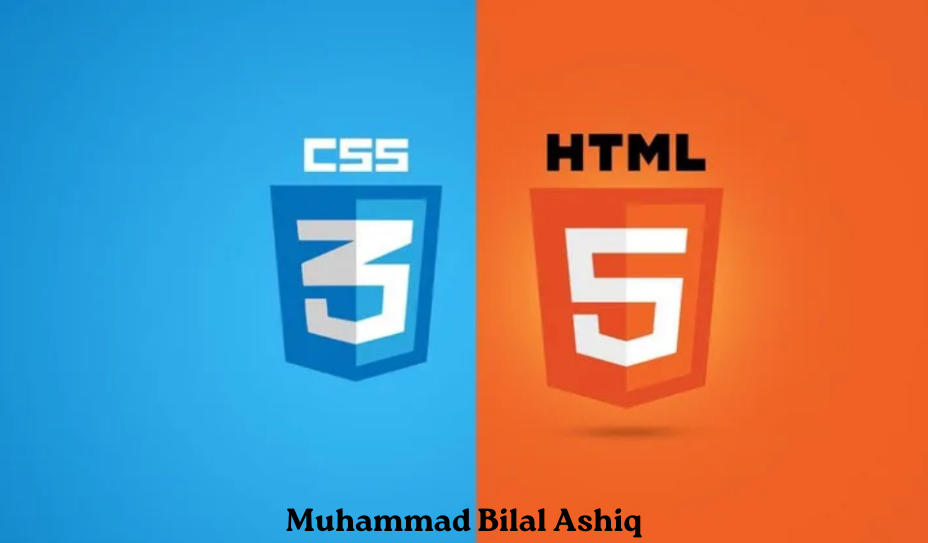

# CSS (Cascading Style Sheets) with HTML
Html and CSS CheetSeet practiced by me.

> [!WARNING]
> It is incomplete repository and will be completed soon.

#### 🔷 What exactly is going on here?
>Cascading Style Sheets (CSS) is a style sheet language used for specifying the presentation and styling of a document written in a markup language such as HTML or XML (including XML dialects such as SVG, MathML or XHTML). CSS is a cornerstone technology of the World Wide Web, alongside HTML and JavaScript
***

<h3 align="center">💣 Support this repository 💣</h3>
 

- By giving this repository a star(⭐️), you made it more visible
- Be sure to send this repository to your friends who are interested in this area
- Follow the gray cube team on other platforms

***
### Writer : Muhammad Bilal Ashiq 

 

  
  
    
    
  

